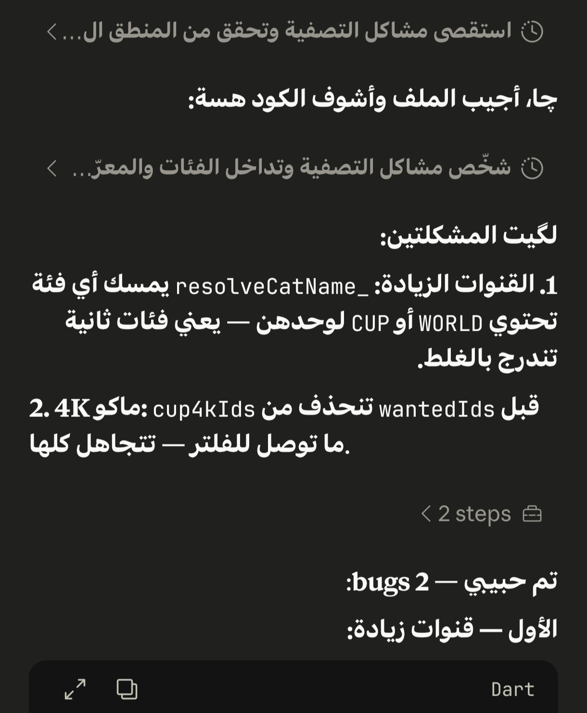
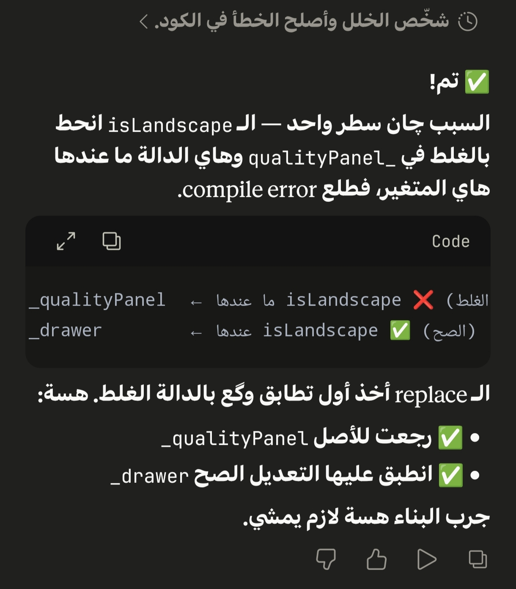

# AI Skills AR — مهارات الذكاء الاصطناعي بالعربية

مجموعة ملفات تعليمات منظّمة تُحمَّل إلى نماذج الذكاء الاصطناعي لضبط أسلوب التواصل وفق سياقات لغوية وثقافية محددة.

---

## المهارات المتوفرة

| المهارة | الوصف |
|---------|-------|
| [**Baghdadi-Pro**](./baghdadi-pro/SKILL.md) | وضع التواصل العراقي البغدادي الاصيل — مُحسَّن للاختصار والدقة التقنية |

---

## المعاينة

<p align="center">
  
  &nbsp;&nbsp;
  
</p>

---

## الاستخدام

حمل او انسخ محتوى ملف `SKILL.md` والصقه في بداية أي محادثة مع نموذج الذكاء الاصطناعي الذي تستخدمه.

**يعمل مع:** Claude · ChatGPT · Gemini · Grok · وأي نموذج يدعم تعليمات مخصصة.

```
[محتوى SKILL.md]

---

اكتب سؤالك هنا
```

### عبر واجهة البرمجة (API)

```python
with open("baghdadi-pro/SKILL.md", "r", encoding="utf-8") as f:
    skill = f.read()

messages = [
    {"role": "system", "content": skill},
    {"role": "user",   "content": "سؤالك هنا"}
]
```

---

## هيكل المستودع

```
ai-skills-ar/
├── README.md
├── assets/
│   ├── preview-1.jpg
│   └── preview-2.jpg
└── baghdadi-pro/
    └── SKILL.md
```

---

## المساهمة

لإضافة مهارة جديدة، أنشئ مجلداً باسمها وأضف ملف `SKILL.md` بداخله، ثم أرسل *Pull Request*.
